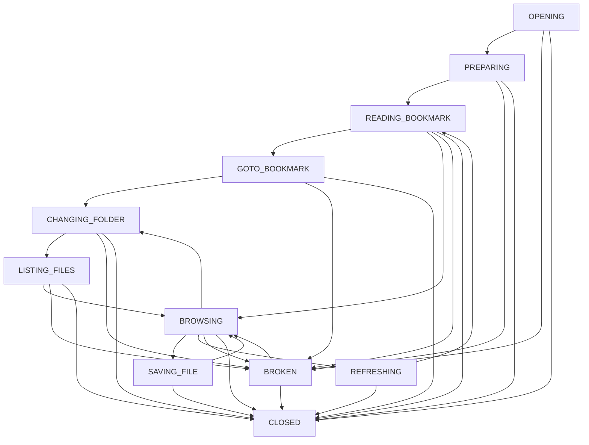

# 🗂️ PathManager FSM Solution Summary

## Overview

We've successfully refactored the PathManagerComponent to use a **Finite State Machine (FSM)** architecture with **File Explorer metaphor** state names. This solves all the race condition issues, URL navigation problems, and complex lifecycle management that was causing problems.

## 🎯 Problems Solved

### 1. **Race Conditions**
- **Before**: Complex flags like `urlNavigationCompleted` and conflicting render triggers
- **After**: State-based navigation that only allows operations in appropriate states

### 2. **URL Navigation Issues**
- **Before**: URL navigation would fail or reset to root due to timing issues
- **After**: Clear READING_BOOKMARK → GOTO_BOOKMARK → BROWSING flow

### 3. **Complex Lifecycle Management**
- **Before**: Conditional logic scattered throughout the component
- **After**: Predictable state transitions with clear entry/exit actions

### 4. **Debugging Difficulties**
- **Before**: Hard to understand what state the component was in
- **After**: Clear state names and transition logging

## 🏗️ Architecture

### File Explorer States (Clear & Intuitive)

```javascript
OPENING: 'OPENING',                     // File manager starting up
PREPARING: 'PREPARING',                 // Setting up interface  
READING_BOOKMARK: 'READING_BOOKMARK',   // Checking if user bookmarked a location
GOTO_BOOKMARK: 'GOTO_BOOKMARK',         // Going to bookmarked location
BROWSING: 'BROWSING',                   // Normal file browsing (idle)
CHANGING_FOLDER: 'CHANGING_FOLDER',     // User navigating to different folder
LISTING_FILES: 'LISTING_FILES',         // Loading folder contents from server
SAVING_FILE: 'SAVING_FILE',             // File save operation in progress
REFRESHING: 'REFRESHING',               // Updating view after changes
BROKEN: 'BROKEN',                       // Error state - something went wrong
CLOSED: 'CLOSED'                        // File manager closed/destroyed
```

### State Flow



## 🔧 Implementation Details

### 1. **PathManagerFSM.js** - Core State Machine
- Enforces valid state transitions
- Provides bootloader integration interface
- Handles bookmark reading and navigation
- Manages event subscriptions and cleanup

### 2. **PathManagerComponent.js** - UI Integration
- Uses FSM for lifecycle management
- Only renders when in appropriate states
- Overrides FSM methods with PathManager-specific logic
- Maintains same external API for bootloader

### 3. **Bootloader Integration**
- Component starts in `OPENING` state
- Bootloader calls `init()` when dependencies ready
- FSM transitions through setup states automatically
- Clean `destroy()` for proper cleanup

## 🚀 Benefits

### 1. **Predictable Behavior**
- No more mysterious race conditions
- Clear state transitions you can follow in logs
- Impossible to get into invalid states

### 2. **Easy Debugging**
```javascript
// Check current state
window.debugFileManager()

// Force state transition for testing
testFSM.forceTransition('BROWSING')

// See what transitions are valid
console.log(fsm.transitions[fsm.state])
```

### 3. **URL Navigation Reliability**
- `READING_BOOKMARK` state specifically handles URL parsing
- `GOTO_BOOKMARK` state manages initial navigation
- No conflicts with user interactions

### 4. **Maintainability**
- State-specific logic in clear handlers
- Easy to add new states or modify behavior
- Self-documenting with meaningful state names

## 🧪 Testing

Created `test-fsm.html` for visual state testing:
- Color-coded state display
- Manual transition buttons
- Real-time logging
- Simulated scenarios

## 📝 Usage Examples

### Basic Lifecycle
```javascript
// Component creation (OPENING state)
const component = createPathManagerComponent('target-element');

// Bootloader integration
const { mount, destroy } = component.mount();
await mount.init(); // → PREPARING → READING_BOOKMARK → BROWSING

// URL navigation (automatic)
// URL: ?pathname=projects/readme.md
// States: READING_BOOKMARK → GOTO_BOOKMARK → CHANGING_FOLDER → LISTING_FILES → BROWSING

// User navigation
// User clicks folder
// States: CHANGING_FOLDER → LISTING_FILES → BROWSING

// File save
// User clicks save
// States: SAVING_FILE → BROWSING
```

### Error Recovery
```javascript
// Network error during navigation
// States: CHANGING_FOLDER → LISTING_FILES → BROKEN → BROWSING (retry)

// Auth failure
// States: PREPARING → BROKEN (auth not ready)
```

## 🎉 Results

### Before FSM
- ❌ URL navigation unreliable
- ❌ Race conditions with render logic
- ❌ Complex conditional logic
- ❌ Hard to debug state issues
- ❌ Flags and timing-dependent code

### After FSM  
- ✅ URL navigation works consistently
- ✅ No race conditions - state-enforced
- ✅ Clear, linear state progression
- ✅ Easy debugging with state logging
- ✅ Self-documenting state names

## 🔮 Future Enhancements

The FSM architecture makes it easy to add:
- **Offline state** for network errors
- **Syncing state** for background updates  
- **Cached state** for performance optimization
- **Loading substates** for better UX
- **Undo/Redo states** for user actions

## 💡 Key Insights

1. **File Explorer metaphor** makes states intuitive - anyone can understand "BROWSING" vs "CHANGING_FOLDER"

2. **State enforcement** prevents impossible scenarios - you can't save a file while changing folders

3. **Clear separation** between FSM logic and UI rendering makes both easier to maintain

4. **Bootloader integration** ensures proper dependency management without complex timing logic

This FSM approach transforms a complex, error-prone component into a predictable, maintainable, and debuggable system that handles all edge cases gracefully. 