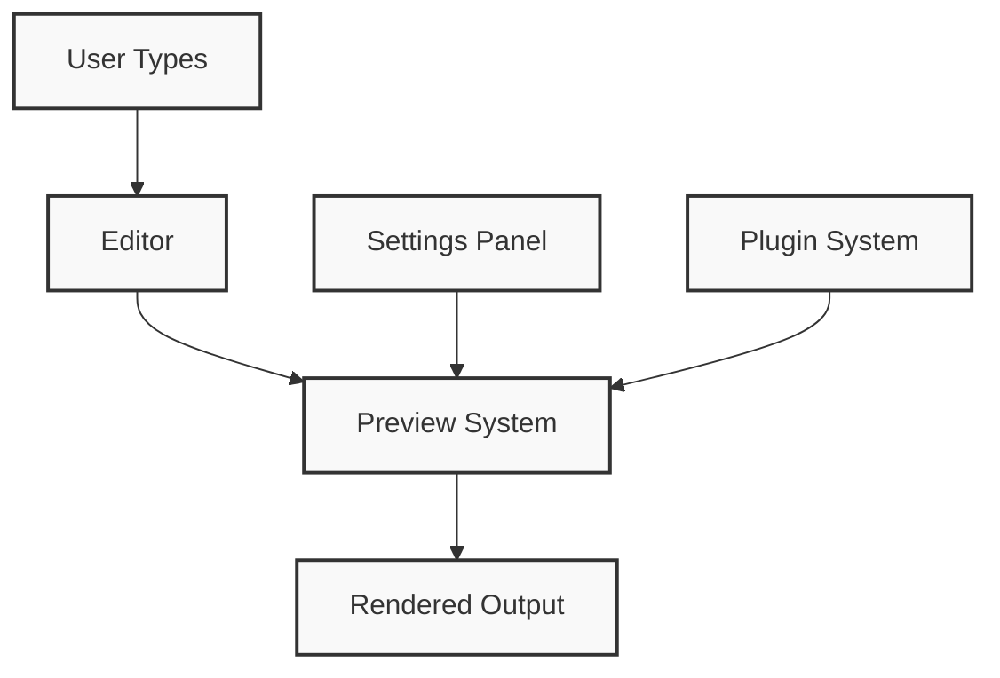
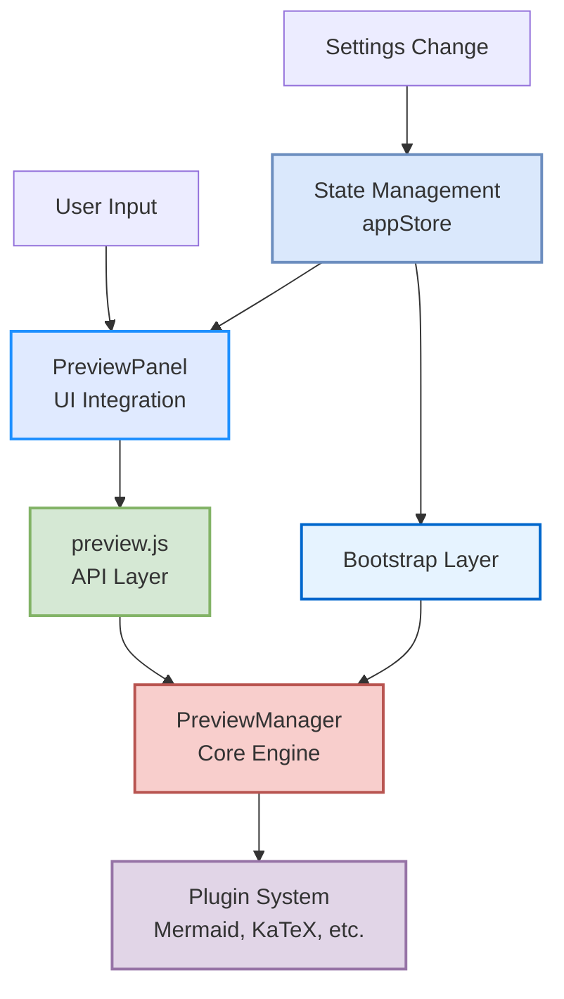
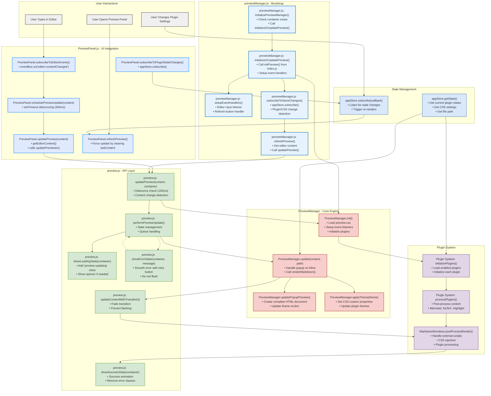

# Preview System Architecture - DevPages

## Overview

The DevPages preview system provides real-time Markdown rendering with plugin support, smooth error handling, and clean initialization. The system is built around a modular architecture with clear separation of concerns.

## Core Components

### 1. **Preview Panel (`PreviewPanel.js`) - UI Integration**
- **Role**: Integrates preview functionality into the panel system
- **Responsibilities**:
  - Manages preview container lifecycle
  - Handles editor content changes via event subscription
  - Provides clean initialization (no placeholder text)
  - Implements smooth error states with retry functionality
  - Subscribes to plugin state changes for automatic refresh

### 2. **Preview Manager (`client/preview/index.js`) - Core Engine**
- **Role**: Central orchestrator for preview rendering
- **Responsibilities**:
  - Manages singleton `PreviewManager` instance
  - Handles markdown-to-HTML conversion
  - Coordinates plugin initialization and processing
  - Manages popup preview windows
  - Applies themes and CSS styling
  - Provides `initPreview()` and `updatePreview()` APIs

### 3. **Preview Orchestrator (`previewManager.js`) - Bootstrap Layer**
- **Role**: Application-level preview initialization and state management
- **Responsibilities**:
  - Initializes preview system on app startup
  - Subscribes to `appStore` for plugin and CSS changes
  - Handles debounced preview updates
  - Manages event listeners for editor changes
  - Coordinates between UI and core preview engine

### 4. **Plugin System (`client/preview/plugins/`) - Extensibility**
- **Role**: Modular plugin architecture for enhanced rendering
- **Key Plugins**:
  - **Highlight.js**: Code syntax highlighting
  - **Mermaid**: Diagram rendering
  - **KaTeX**: Mathematical expressions
  - **Audio-MD**: Audio player integration
  - **CSS Plugin**: Dynamic stylesheet management

### 5. **State Management (`appState.js`) - Configuration**
- **Role**: Central state store for preview settings
- **Manages**:
  - Plugin enabled/disabled states
  - CSS file configurations
  - Theme preferences
  - Preview-specific settings

## Detailed Architecture Flow

### **Simple Context Diagram**



### **Medium Detail Architecture**



### **Detailed Function-Level Flow**



## Key Improvements

### **Clean Initialization Experience**
- ✅ **No placeholder text**: Preview starts empty and loads content smoothly
- ✅ **Minimal loading indicators**: Subtle spinner without distracting text
- ✅ **Graceful startup**: System initializes quietly in the background

### **Enhanced Error Handling**
- ✅ **No red flash**: Replaced harsh red errors with gentle warning colors
- ✅ **Smooth animations**: Error states slide in gracefully
- ✅ **Retry functionality**: Users can retry failed renders with one click
- ✅ **Auto-recovery**: System attempts to recover from transient errors

### **Performance Optimizations**
- ✅ **Debounced updates**: Prevents excessive re-renders during rapid typing
- ✅ **Content change detection**: Skips updates when content hasn't changed
- ✅ **Plugin state caching**: Only re-initializes when plugin settings change
- ✅ **CSS bundling**: Efficient stylesheet management

## File Structure

```
client/
├── preview.js                    # Main API layer
├── previewManager.js            # Bootstrap orchestrator
├── preview/
│   ├── index.js                 # Core PreviewManager class
│   ├── preview.css              # Enhanced styling with smooth transitions
│   ├── plugins/
│   │   ├── index.js             # Plugin registration system
│   │   ├── highlight.js         # Code highlighting
│   │   ├── mermaid.js           # Diagram rendering
│   │   ├── katex.js             # Math expressions
│   │   └── audio-md.js          # Audio integration
│   └── renderers/
│       └── MarkdownRenderer.js  # Core markdown processing
├── panels/types/
│   └── PreviewPanel.js          # Panel integration
└── settings/
    └── PreviewSettingsPanel.js  # Interactive preview controls
```

## Integration Points

### **1. Editor Integration**
```javascript
// PreviewPanel subscribes to editor changes
subscribeToEditorEvents() {
    window.eventBus.on('editor:contentChanged', (data) => {
        this.schedulePreviewUpdate(data.content);
    });
}
```

### **2. Plugin State Management**
```javascript
// Automatic refresh when plugins change
appStore.subscribe((newState, prevState) => {
    const pluginsChanged = JSON.stringify(newState.plugins) !== 
                          JSON.stringify(prevState.plugins);
    if (pluginsChanged) {
        this.refreshPreview();
    }
});
```

### **3. Settings Integration**
```javascript
// PreviewSettingsPanel provides user controls
{
    id: 'preview-settings-container',
    title: 'Preview',
    component: PreviewSettingsPanel,
    order: 25
}
```

## API Reference

### **Core Functions**

- **`initPreview(options)`**: Initialize preview system with container
- **`updatePreview(content, container)`**: Update preview with new content
- **`showLoadingState(container)`**: Display loading indicator
- **`showErrorState(container, message)`**: Display error with retry option
- **`showSuccessState(container)`**: Indicate successful render

### **Configuration Options**

```javascript
const previewOptions = {
    container: HTMLElement,           // Required: Preview container
    plugins: ['highlight', 'mermaid'], // Enabled plugins
    theme: 'light',                   // Theme preference
    renderMode: 'inline',             // 'inline' or 'iframe'
    smoothErrors: true,               // Use gentle error styling
    autoRetry: true,                  // Enable auto-retry on errors
    debounceDelay: 150               // Update debounce timing
};
```

## Best Practices

1. **Always provide a container**: Preview requires a valid HTMLElement
2. **Handle errors gracefully**: Use the built-in error states for consistency
3. **Debounce updates**: Prevent excessive re-renders during rapid changes
4. **Subscribe to state changes**: Keep preview in sync with app settings
5. **Clean up subscriptions**: Prevent memory leaks in panel lifecycle

---

**The preview system now provides a bulletproof, user-friendly experience with smooth transitions, intelligent error handling, and clean initialization.**

## Function Call Sequences

### **1. User Types in Editor → Preview Update**

```javascript
// 1. User types in editor
User types → Editor fires 'editor:contentChanged' event

// 2. PreviewPanel receives event
PreviewPanel.subscribeToEditorEvents()
  → eventBus.on('editor:contentChanged', callback)
  → PreviewPanel.schedulePreviewUpdate(content)

// 3. Debounced update
PreviewPanel.schedulePreviewUpdate(content)
  → setTimeout(() => PreviewPanel.updatePreview(content), 300)

// 4. Panel calls API layer
PreviewPanel.updatePreview(content)
  → this.getEditorContent()
  → updatePreviewer(content, previewContainer)  // from preview.js

// 5. API layer processes update
preview.js: updatePreview(content, container)
  → Content change detection
  → setTimeout(() => performPreviewUpdate(), 150)  // Debounce

// 6. Core update logic
preview.js: performPreviewUpdate(content, container)
  → showLoadingState(container)  // Show spinner
  → updatePreviewInternal(content, currentPath)  // PreviewManager.update()
  → updateContentWithTransition(container, html)  // Smooth transition
  → postProcessRender(container)  // Plugin processing
  → showSuccessState(container)  // Success animation
```

### **2. Plugin Settings Change → Preview Refresh**

```javascript
// 1. User changes plugin settings
User toggles plugin → SettingsPanel dispatches action → appStore updates

// 2. Store subscription triggers
PreviewPanel.subscribeToPluginStateChanges()
  → appStore.subscribe((newState, prevState) => {
      const pluginsChanged = JSON.stringify(newState.plugins) !== JSON.stringify(prevState.plugins)
      if (pluginsChanged) setTimeout(() => this.refreshPreview(), 100)
    })

// 3. Force refresh
PreviewPanel.refreshPreview()
  → this.lastContent = ''  // Force update
  → this.updatePreview()  // Restart flow from step 4 above
```

### **3. Application Startup → Preview Initialization**

```javascript
// 1. Bootstrap initialization
Bootstrap.js calls → previewManager.initializePreviewManager()

// 2. Check prerequisites
previewManager.js: initializePreviewManager()
  → Check document.querySelector('#preview-container') exists
  → initializeOrUpdatePreview(false)

// 3. Core initialization
previewManager.js: initializeOrUpdatePreview(isUpdate = false)
  → initPreview({ container: '#preview-container', plugins: [...] })
  → setupEventHandlers()
  → subscribeToStoreChanges()

// 4. PreviewManager setup
PreviewManager.init()
  → Load preview.css dynamically
  → this.previewElement.classList.add('markdown-preview')
  → Initialize plugins
  → Apply initial theme
  → applyCssStyles()

// 5. Event handler setup
previewManager.js: setupEventHandlers()
  → editor.addEventListener('input', debouncePreviewUpdate)
  → refreshBtn.addEventListener('click', refreshPreview)
  → document.addEventListener('view:changed', handleViewChange)
```

### **4. Error Handling Flow**

```javascript
// Error occurs during rendering
preview.js: performPreviewUpdate() catches error
  → showErrorState(container, error.message)
  → Creates retry button with onclick handler
  → Uses warning colors (no red flash)

// User clicks retry
Retry button clicked
  → this.closest('.preview-container').dataset.forceRefresh = 'true'
  → window.dispatchEvent(new CustomEvent('preview:retry'))
  → Triggers new update cycle
``` 