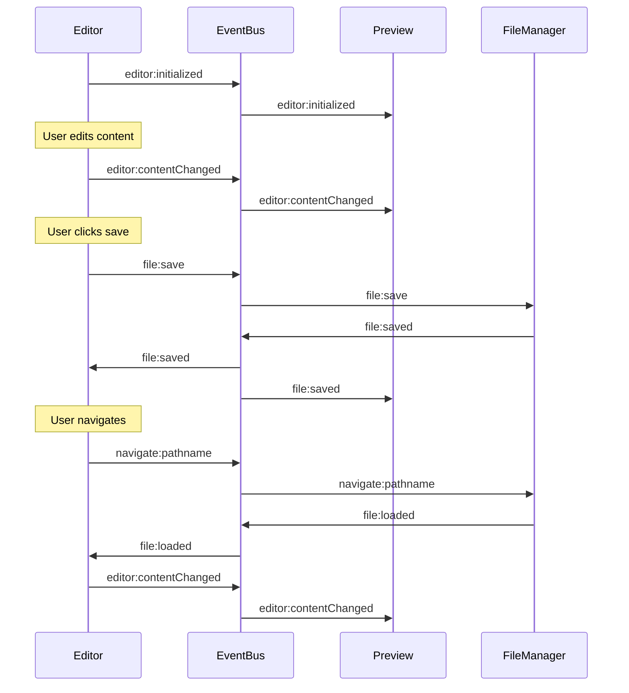

# EventBus Technical Documentation

## Overview

The EventBus is a core communication mechanism in DevPages that implements the publish-subscribe (pub/sub) pattern. It enables loosely coupled communication between components, allowing them to interact without direct dependencies.

## Implementation Details

The EventBus is implemented as a singleton class with the following characteristics:

- **Data Structure**: Uses a `Map<String, Set<Function>>` to store event handlers
- **Handler Management**: Handlers are stored in Sets to ensure uniqueness
- **Error Isolation**: Each handler execution is wrapped in try/catch to prevent cascading failures

```javascript
// Core data structure
this.handlers = new Map();

// Example internal representation
// handlers = {
//   'editor:contentChanged': Set([handlerFn1, handlerFn2]),
//   'file:save': Set([handlerFn3]),
//   'auth:loginRequested': Set([handlerFn4])
// }
```

## API Reference

### on(event, handler)
Registers a handler function for a specific event.

```javascript
eventBus.on('editor:contentChanged', (data) => {
  console.log('Content changed:', data.content);
});
```

### off(event, handler)
Unregisters a previously registered handler.

```javascript
const myHandler = (data) => { /* ... */ };
eventBus.on('some:event', myHandler);
// Later:
eventBus.off('some:event', myHandler);
```

### emit(eventName, data)
Triggers an event, calling all registered handlers with the provided data.

```javascript
eventBus.emit('editor:contentChanged', { 
  content: 'New content',
  timestamp: Date.now()
});
```

## Message Sequence Chart

Below is a Message Sequence Chart showing typical interactions between components using the EventBus:



## Common Events

| Event Name | Category | Publishers | Subscribers | Data Payload | Description |
|------------|----------|------------|-------------|--------------|-------------|
| `editor:contentChanged` | Data Change | Editor, FileManager | Preview, LogPanel | `{ content, timestamp }` | Fired when editor content changes |
| `editor:initialized` | Lifecycle | Editor | Preview, LogPanel | `{}` | Fired when editor is initialized |
| `editor:save` | Command | UI Components | FileManager | `{}` | Request to save current file |
| `editor:focus` | UI | Editor | LogPanel | `{}` | Editor gained focus |
| `editor:blur` | UI | Editor | LogPanel | `{}` | Editor lost focus |
| `navigate:pathname` | Command | UI Components | FileManager | `{ pathname, isDirectory }` | Navigate to specified path |
| `navigate:absolute` | Command | UI Components | FileManager | `{ dir, path, file }` | Navigate to absolute path |
| `navigate:root` | Command | UI Components | FileManager | `{}` | Navigate to root directory |
| `auth:loginRequested` | Request | LoginForm | AuthManager | `{ username, password }` | Login requested with credentials |
| `ui:viewModeChanged` | UI | ViewControls | Preview, Editor | `viewMode` | View mode changed |
| `ui:renderFileList` | UI | FileManager | UI Components | `{}` | Request to render file list |
| `preview:initialized` | Lifecycle | Preview | Editor | `{}` | Preview component initialized |
| `preview:updated` | Data Change | Preview | LogPanel | `{ content, frontMatter }` | Preview content updated |
| `preview:cssSettingsChanged` | Settings | SettingsPanel | Preview | `{}` | CSS settings changed |
| `file:save` | Command | UI Components | FileManager | `{}` | Request to save current file |
| `file:loaded` | Data Change | FileManager | Editor, Preview | `{ content, metadata }` | File loaded into editor |
| `image:uploaded` | Data Change | ImageUploader | Editor | `{ url, filename }` | Image upload completed |
| `image:deleted` | Data Change | ImageManager | UI Components | `{ imageName }` | Image deleted |
| `app:ready` | Lifecycle | Bootstrap | All Components | `{}` | Application initialization complete |

## Event Categories and Flow

The EventBus handles several categories of events that flow through the application:

### User Interface Events
- Triggered by user interactions
- Example: Clicking save button → `file:save` event

### Component Lifecycle Events
- Signal component state changes
- Example: `editor:initialized`, `preview:initialized`

### Data Change Events
- Notify about changes to application data
- Example: `editor:contentChanged`, `file:loaded`

### Request Events
- Request actions from other components
- Example: `navigate:pathname`, `auth:loginRequested`

## Integration with State Management

The EventBus complements the Redux-like state management system in DevPages:

1. **UI Events** → EventBus → Action Handlers
2. Action Handlers → **Store Dispatch** (Redux-like actions)
3. Store → **State Updates** → UI Components
4. UI Components → **Render Updates**

This hybrid approach allows DevPages to:
- Use EventBus for component communication
- Use Redux-like state for application state management
- Keep each system focused on its strengths

## Common Event Patterns

### Request-Response Pattern
```
Component A → EventBus (request:something) → Component B
Component B → EventBus (response:something) → Component A
```

### Notification Pattern
```
Component A → EventBus (a:changed) → Components B, C, and D all update
```

### Command Pattern
```
Component A → EventBus (do:something) → Component B executes action
```

## Performance Considerations

- Event handler registration should happen during component initialization
- Handlers should be lightweight to avoid blocking the event loop
- Consider removing handlers when components are unmounted/disposed 