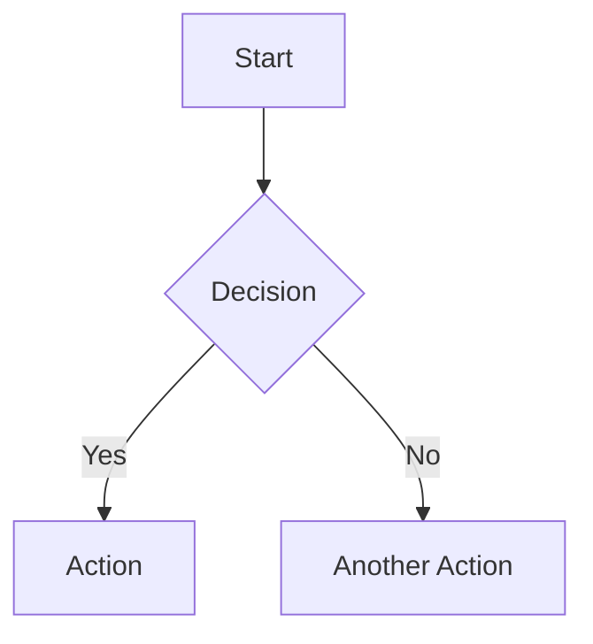

# Markdown Preview System

A robust, plugin-based Markdown preview system with support for:

- Markdown rendering with GitHub Flavored Markdown
- Mermaid diagrams
- Math expressions (KaTeX)
- Syntax highlighting for code blocks
- AudioMD timestamps for audio transcripts
- Custom plugin support

## Basic Usage

```javascript
import { initPreview, updatePreview } from './preview/index.js';

// Initialize once
initPreview({
  container: '#md-preview',
  plugins: ['mermaid', 'katex', 'highlight', 'audioMD'],
  theme: 'light'
});

// Update the preview when content changes
updatePreview(markdownContent);
```

## Configuration Options

The `initPreview` function accepts these options:

- `container`: CSS selector or HTML element for the preview container
- `plugins`: Array of plugin names to enable
- `theme`: 'light' or 'dark'
- `updateDelay`: Milliseconds to wait before updating (default: 100)
- `autoRender`: Whether to auto-render on content changes (default: true)

## Plugin System

### Built-in Plugins

#### Mermaid Diagrams

Renders Mermaid diagrams in code blocks with the `mermaid` language identifier.

```markdown


#### Math Expressions (KaTeX)

Renders mathematical expressions with KaTeX.

```markdown
Inline math: $E = mc^2$

Block math:
$$
\frac{d}{dx}\left( \int_{0}^{x} f(u)\,du\right)=f(x)
$$
```

#### Syntax Highlighting

Automatically highlights code blocks with language identifiers.

```markdown
```javascript
function example() {
  return "This will be highlighted";
}
```

#### AudioMD

Enables timestamp links to control audio playback.

```markdown
```audio
{
  "src": "/uploads/audio/recording.mp3",
  "title": "Meeting Recording",
  "description": "Team discussion on project timeline"
}
```

Timestamps: [00:15](#audio) [01:23](#audio)
```

### Creating Custom Plugins

Create a plugin with this structure:

```javascript
// myPlugin.js
export default {
  // Required: Initialize the plugin
  init(options) {
    // Setup code
    return true;
  },
  
  // Optional: Process content before rendering
  preProcess(content) {
    return modifiedContent;
  },
  
  // Optional: Process HTML after rendering
  postProcess(element, originalContent) {
    // Manipulate the DOM
  },
  
  // Optional: Update theme
  setTheme(theme) {
    // Apply theme changes
  },
  
  // Optional: Custom renderers for markdown elements
  renderers: {
    code(code, infostring, escaped) {
      // Handle code blocks
    },
    link(href, title, text) {
      // Handle links
    },
    // Other renderer overrides
  }
};

// Register the plugin
import { registerPlugin } from './preview/index.js';
registerPlugin('myPlugin', myPlugin);
```

## Styling

The preview system includes default styles in `styles.css`. You can customize these by:

1. Modifying the CSS variables:
   ```css
   :root {
     --md-preview-bg: #ffffff;
     --md-preview-color: #333333;
     --md-preview-code-bg: #f5f5f5;
     --md-preview-border: #ddd;
     --md-preview-blockquote: #eee;
     --md-preview-link: #07c;
   }
   ```

2. Adding your own CSS that targets the `.markdown-preview` container or its child elements.

## Advanced Usage

### Render programmatically

```javascript
import { renderMarkdown } from './preview/index.js';

async function generateHTML() {
  const html = await renderMarkdown(markdownContent);
  return html;
}
```

### Change theme dynamically

```javascript
import { setPreviewTheme } from './preview/index.js';

// Switch to dark theme
setPreviewTheme('dark');

// Switch to light theme
setPreviewTheme('light');
```

### Access configuration

```javascript
import { getPreviewConfig } from './preview/index.js';

const config = getPreviewConfig();
console.log('Current theme:', config.theme);
``` 