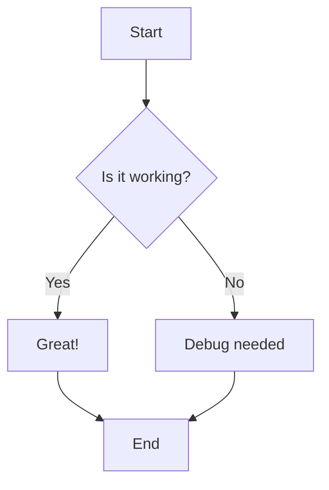
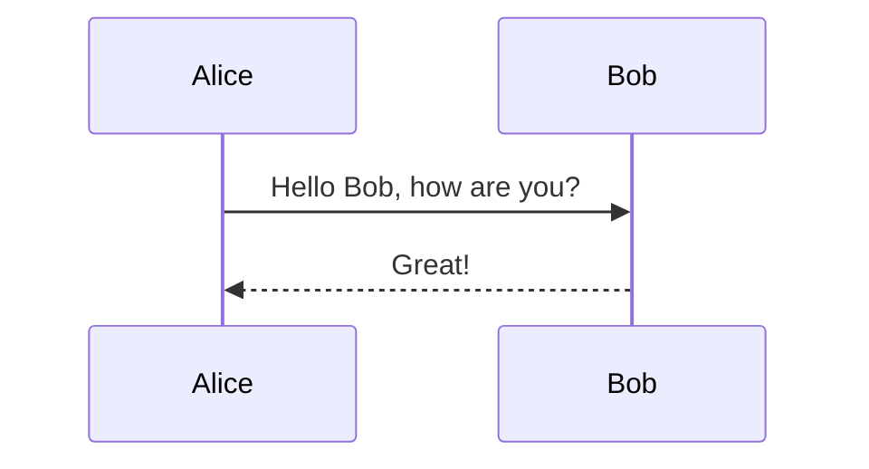

# Mermaid Test

This is a test of Mermaid rendering:

```mermaid
graph TD
    A[Start] --> B{Is it working?}
    B -->|Yes| C[Great!]
    B -->|No| D[Debug needed]
    C --> E[End]
    D --> E
```

Another diagram:

```mermaid
sequenceDiagram
    participant A as Alice
    participant B as Bob
    A->>B: Hello Bob, how are you?
    B-->>A: Great!
``` 