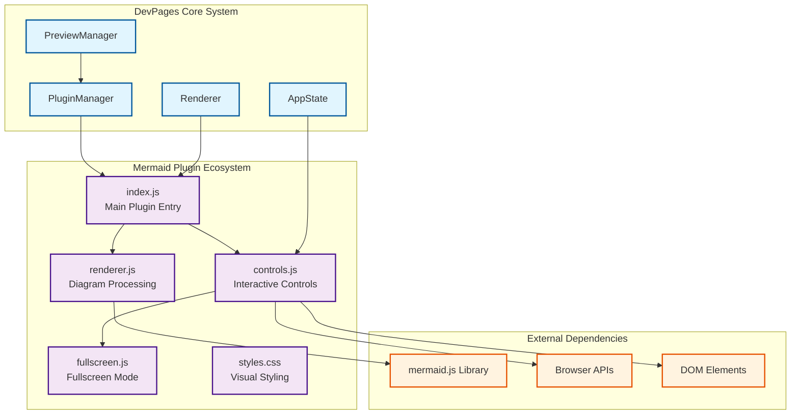
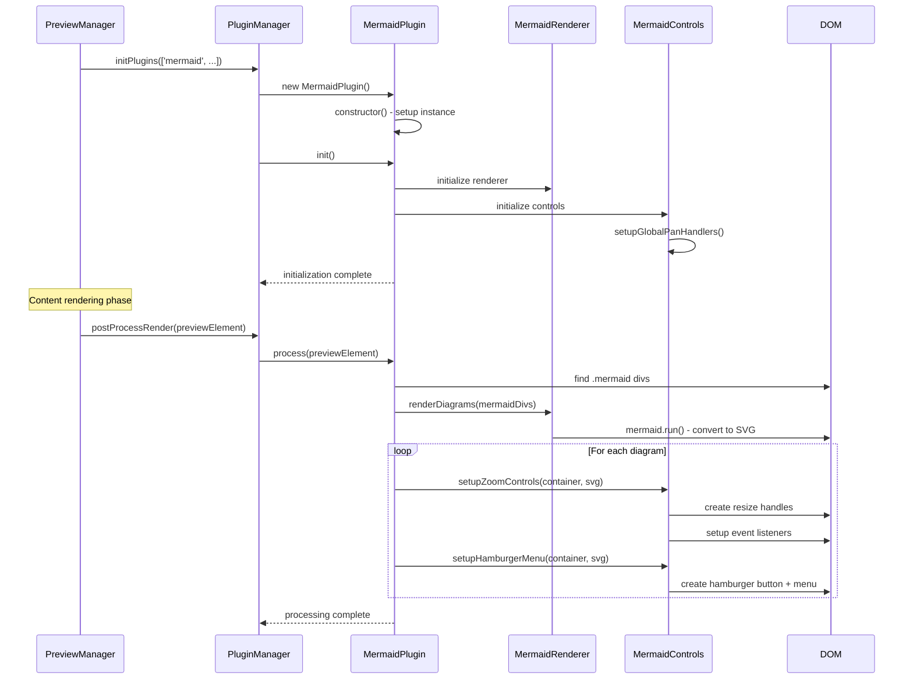
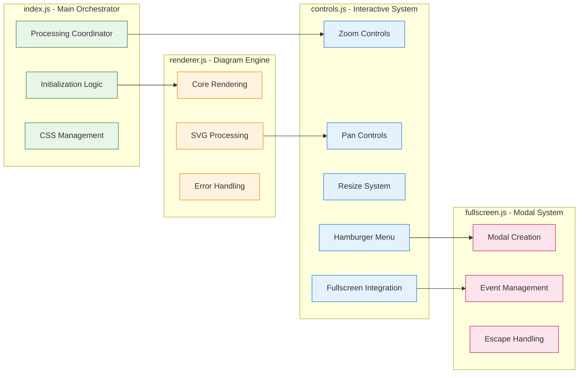
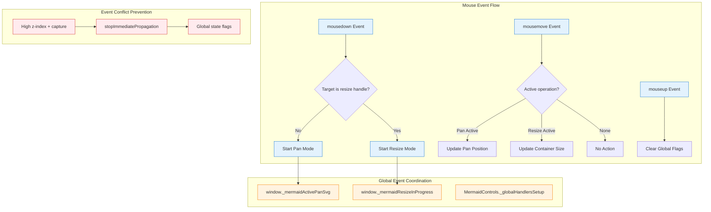
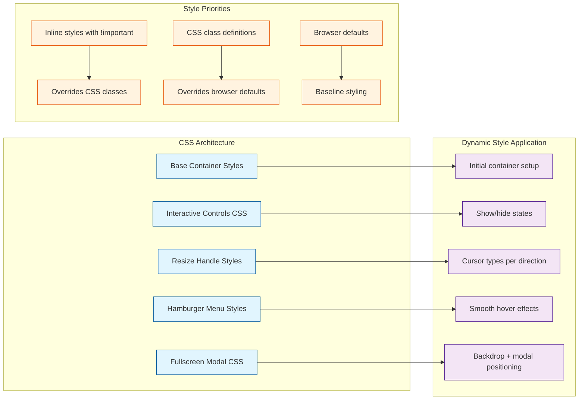
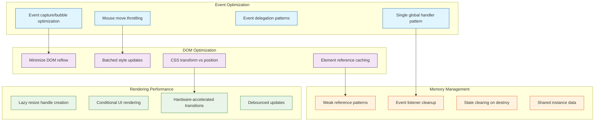
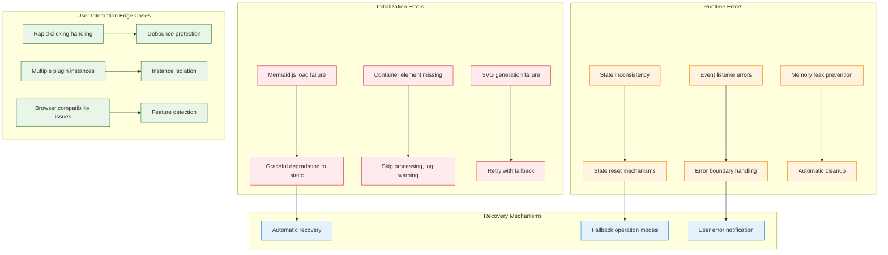
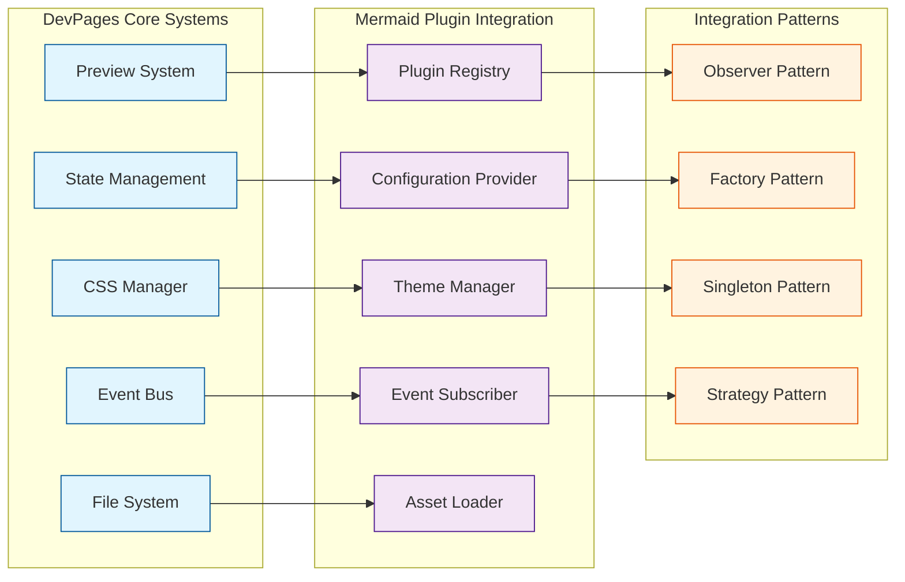

# Mermaid Plugin Architecture - Technical Deep Dive

## Overview

The Mermaid Plugin is a sophisticated, modular interactive visualization system that integrates seamlessly with the DevPages preview engine. It provides advanced user controls including zoom, pan, resize, and fullscreen capabilities through a modern, event-driven architecture.

## System Architecture

The plugin follows a modular design pattern with clear separation of concerns:



## Plugin Integration Flow

The mermaid plugin integrates with the DevPages system through a well-defined initialization and processing pipeline:



## Modular Architecture Deep Dive

### Core Module Structure



### Interactive Controls System

The controls system is the most sophisticated part of the plugin, managing multiple interaction modes:

```mermaid
stateDiagram-v2
    [*] --> Default
    Default --> HoverDetected : Mouse enters container
    HoverDetected --> HamburgerVisible : Show hamburger menu
    HamburgerVisible --> HoverDetected : Mouse leaves (menu not open)
    HamburgerVisible --> MenuOpen : Click hamburger
    
    MenuOpen --> ResizeEnabled : First hamburger click
    MenuOpen --> MenuClosed : Click outside / select option
    MenuClosed --> HamburgerVisible : Return to hover state
    
    ResizeEnabled --> PanMode : Click/drag on SVG content
    ResizeEnabled --> ResizeMode : Click/drag on resize handle
    ResizeEnabled --> FullscreenMode : Click fullscreen option
    
    PanMode --> ResizeEnabled : Mouse up
    ResizeMode --> ResizeEnabled : Mouse up
    FullscreenMode --> ResizeEnabled : Exit fullscreen
    
    note right of ResizeEnabled
        - Blue resize handles visible
        - All interactions available
        - Global pan/resize flags active
    end note
    
    note right of ResizeMode
        - Global resize flag prevents pan
        - Container dimensions updated
        - Cursor shows resize direction
    end note
```

## Event Handling Architecture

The plugin implements a sophisticated event handling system that prevents conflicts between different interaction modes:



## Resize System Technical Implementation

The resize system is a key innovation that required solving complex event conflicts:

```mermaid
graph TB
    subgraph "Resize Handle Creation"
        CreateHandles[Create 8 directional handles]
        CreateHandles --> Corners[4 Corner Handles<br/>nw, ne, sw, se]
        CreateHandles --> Edges[4 Edge Handles<br/>n, s, e, w]
        
        Corners --> CornerLogic[Diagonal resize logic]
        Edges --> EdgeLogic[Directional resize logic]
    end
    
    subgraph "Event Priority System"
        MouseDownCapture[mousedown with capture:true]
        MouseDownCapture --> TargetCheck{event.target check}
        TargetCheck -->|Resize Handle| PreventPan[Set resize flag]
        TargetCheck -->|SVG Content| AllowPan[Allow pan operation]
        
        PreventPan --> ResizeOperation[Execute resize]
        AllowPan --> PanOperation[Execute pan]
    end
    
    subgraph "Dimension Calculation"
        StartPosition[Record start position/size]
        StartPosition --> DeltaCalc[Calculate mouse delta]
        DeltaCalc --> NewDimensions[Calculate new dimensions]
        NewDimensions --> MinConstraints[Apply min/max constraints]
        MinConstraints --> ApplyStyles[Apply with !important]
    end
    
    subgraph "Visual Feedback"
        InitiallyHidden[opacity: 0, pointer-events: none]
        FirstHamburger[First hamburger click]
        FirstHamburger --> ShowHandles[opacity: 0.6, pointer-events: auto]
        ShowHandles --> UserResize[User can resize]
    end
    
    classDef creation fill:#e8f5e8,stroke:#2e7d32
    classDef priority fill:#fff3e0,stroke:#f57c00
    classDef calculation fill:#e3f2fd,stroke:#1976d2
    classDef feedback fill:#fce4ec,stroke:#c2185b
    
    class CreateHandles,Corners,Edges,CornerLogic,EdgeLogic creation
    class MouseDownCapture,TargetCheck,PreventPan,AllowPan,ResizeOperation,PanOperation priority
    class StartPosition,DeltaCalc,NewDimensions,MinConstraints,ApplyStyles calculation
    class InitiallyHidden,FirstHamburger,ShowHandles,UserResize feedback
```



## CSS Integration and Styling

The plugin includes a sophisticated CSS system that handles both functionality and aesthetics:



## Data Flow and State Management

The plugin maintains state across multiple dimensions while integrating with the global application state:

```mermaid
flowchart TD
    subgraph "Plugin Instance State"
        InstanceVars[Instance Variables]
        InstanceVars --> FirstClick[firstHamburgerClick: boolean]
        InstanceVars --> ResizeEnabled[resizeEnabled: boolean]
        InstanceVars --> ActiveListeners[activeListeners: array]
    end
    
    subgraph "Global Window State"
        WindowState[Window-level State]
        WindowState --> ActivePanSVG[_mermaidActivePanSvg]
        WindowState --> PanData[_mermaidPanData]
        WindowState --> ResizeFlag[_mermaidResizeInProgress]
    end
    
    subgraph "DOM Element State"
        ElementState[Element-attached State]
        ElementState --> SVGState[svg._mermaidState: {scale, panX, panY}]
        ElementState --> ApplyTransform[svg._applyTransform: function]
        ElementState --> Listeners[element._mermaidListeners]
    end
    
    subgraph "Application Integration"
        AppStateInt[App State Integration]
        AppStateInt --> PluginConfig[Plugin configuration]
        AppStateInt --> ThemeSettings[Theme settings]
        AppStateInt --> EventBus[Event bus notifications]
    end
    
    subgraph "State Synchronization"
        StateSync[State Synchronization]
        InstanceVars --> StateSync
        WindowState --> StateSync
        ElementState --> StateSync
        AppStateInt --> StateSync
        
        StateSync --> Consistency[Consistent UI state]
        StateSync --> Persistence[State persistence]
        StateSync --> EventCoordination[Cross-instance coordination]
    end
    
    classDef instance fill:#e8f5e8,stroke:#2e7d32
    classDef global fill:#fff3e0,stroke:#f57c00
    classDef element fill:#e3f2fd,stroke:#1976d2
    classDef app fill:#fce4ec,stroke:#c2185b
    classDef sync fill:#f3e5f5,stroke:#4a148c
    
    class InstanceVars,FirstClick,ResizeEnabled,ActiveListeners instance
    class WindowState,ActivePanSVG,PanData,ResizeFlag global
    class ElementState,SVGState,ApplyTransform,Listeners element
    class AppStateInt,PluginConfig,ThemeSettings,EventBus app
    class StateSync,Consistency,Persistence,EventCoordination sync
```

## Performance Optimizations

The plugin implements several performance optimizations to ensure smooth operation:



## Error Handling and Edge Cases

The plugin includes comprehensive error handling for various edge cases:



## Integration Points with DevPages Core

The plugin integrates with multiple DevPages core systems:



## Conclusion

The Mermaid Plugin represents a sophisticated example of modular JavaScript architecture, demonstrating:

1. **Clean Separation of Concerns**: Each module has a single, well-defined responsibility
2. **Event-Driven Architecture**: Loose coupling through global event coordination
3. **Performance Optimization**: Minimal DOM manipulation and efficient event handling
4. **Robust Error Handling**: Comprehensive error boundaries and fallback mechanisms
5. **Extensible Design**: Easy to add new interactive features or modify existing ones

The plugin's architecture serves as a template for building other interactive preview plugins within the DevPages ecosystem, providing a blueprint for handling complex user interactions while maintaining system performance and reliability.

### Key Technical Achievements

- **Zero-conflict interaction system**: Multiple interaction modes coexist without interference
- **Progressive enhancement**: Graceful degradation when features aren't available
- **Memory-efficient design**: Proper cleanup and resource management
- **Browser compatibility**: Works across modern browser environments
- **Developer-friendly**: Clean APIs and extensive debugging capabilities

This architecture enables rich, interactive diagram experiences while maintaining the lightweight, fast performance that DevPages requires for real-time markdown preview and editing. 