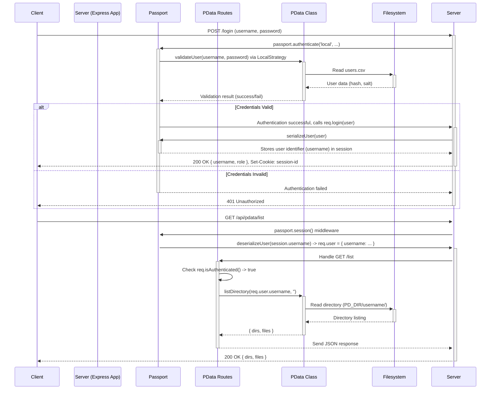

# @your-scope/pdata

[](https://badge.fury.io/js/%40your-scope%2Fpdata) <!-- Optional: Add badges if published -->

A Node.js module providing secure, user-scoped file storage and management capabilities, intended for use within Express.js applications utilizing Passport for authentication. It leverages the local filesystem and uses CSV files for user and role management.

## Features

*   **User-Scoped Filesystem:** Restricts file access based on the authenticated user.
*   **Core File Operations:** Provides programmatic access to list directories, read, write, and delete files within a user's permitted scope.
*   **File Uploads:** Includes functionality and Express routes to handle secure file uploads via `multer`.
*   **Express Route Integration:** Offers a factory function to easily mount pre-built API routes into an existing Express application.
*   **CSV-Based User Management:** Uses a simple `users.csv` file for storing user credentials and roles (password hashing handled internally).
*   **Command-Line Utility:** Includes a CLI tool (`pdata-usermgr`) for managing users (add, list, update password, delete).

## Prerequisites

*   **Node.js:** Version >= 18.0.0 (as specified in `package.json`)
*   **Environment Variable:** The `PD_DIR` environment variable **must** be set to the absolute path of the directory where PData should store its data (including `users.csv`). This directory must exist and be writable by the Node.js process.
*   **HTTPS:** Essential for any application using authentication to protect credentials in transit.

## Installation

Install the package along with its necessary peer dependencies:

```bash
npm install @your-scope/pdata express passport express-session multer
# or
yarn add @your-scope/pdata express passport express-session multer
```

## Usage

This package can be used in two main ways: programmatically via the `PData` class, and by integrating its pre-built Express routes.

### 1. Using the `PData` Class

You can import and use the `PData` class directly for lower-level control over file operations and user validation.

```javascript
import { PData } from '@your-scope/pdata';

// Ensure PD_DIR environment variable is set before this runs!
let pdataInstance;
try {
  pdataInstance = new PData();
  console.log('PData initialized.');
} catch (error) {
  console.error('Failed to initialize PData:', error);
  process.exit(1);
}

async function exampleUsage(username, password) {
  try {
    // Validate a user
    const isValid = pdataInstance.validateUser(username, password);
    if (!isValid) {
      console.log(`Invalid credentials for ${username}`);
      return;
    }
    console.log(`User ${username} validated.`);

    // Get user role
    const role = pdataInstance.getUserRole(username);
    console.log(`Role for ${username}: ${role}`);

    // List user's root directory
    const { dirs, files } = await pdataInstance.listDirectory(username, '');
    console.log(`Root contents for ${username}:`, { dirs, files });

    // Write a file
    await pdataInstance.writeFile(username, 'my-notes.txt', 'Hello from PData!');
    console.log('File written.');

    // Read a file
    const content = await pdataInstance.readFile(username, 'my-notes.txt');
    console.log('File content:', content);

    // Delete a file
    // await pdataInstance.deleteFile(username, 'my-notes.txt');
    // console.log('File deleted.');

  } catch (error) {
    console.error('PData operation failed:', error);
  }
}

// Example call (replace with actual credentials)
// exampleUsage('someuser', 'somepassword');
```

### 2. Integrating Express API Routes

This is the primary intended use case. The package provides an Express router factory that bundles common API endpoints.

**Server Setup Example (`server.js`):**

```javascript
import express from 'express';
import session from 'express-session';
import passport from 'passport';
// Potentially import your Passport LocalStrategy configuration here
// import './config/passport-setup.js'; // Example path

import { PData, createPDataRoutes } from '@your-scope/pdata';

// --- Basic App Setup ---
const app = express();
app.use(express.json());
app.use(express.urlencoded({ extended: true }));

// --- PData Initialization ---
// Ensure PD_DIR environment variable is set before this runs!
let pdataInstance;
try {
  pdataInstance = new PData();
  console.log('[Server] PData initialized successfully.');
} catch (error) {
  console.error('[Server] CRITICAL: PData failed to initialize.', error);
  process.exit(1);
}

// --- Session & Passport Middleware ---
app.use(session({
  secret: process.env.SESSION_SECRET || 'your-strong-secret', // Use env var for secrets!
  resave: false,
  saveUninitialized: false,
  cookie: {
    secure: process.env.NODE_ENV === 'production', // Set to true if using HTTPS
    httpOnly: true,
    maxAge: 24 * 60 * 60 * 1000 // 24 hours
  }
}));
app.use(passport.initialize());
app.use(passport.session());

// --- Passport Configuration (Example Placeholders) ---
// You MUST configure Passport strategies (e.g., LocalStrategy)
// and serialization/deserialization elsewhere in your app.
// passport.use(new LocalStrategy(...)); // Defined elsewhere
passport.serializeUser((user, done) => {
  done(null, user.username); // Store username in session
});
passport.deserializeUser((username, done) => {
  // In a real app, you might fetch more user details here if needed
  // For PData routes, just the username is often sufficient
  const user = { username: username };
  done(null, user); // Attach user object to req.user
});

// --- Authentication Routes (Your App's Login/Logout) ---
// You need to provide your own login/logout routes
// that use passport.authenticate() and req.login()/req.logout()
// Example: app.post('/login', passport.authenticate('local'), (req, res) => { ... });
// Example: app.post('/logout', (req, res) => { req.logout(...); });

// --- Mount PData API Routes ---
// The createPDataRoutes function requires the initialized PData instance.
// The routes it creates expect Passport authentication middleware to have run first.
const pdataApiRouter = createPDataRoutes(pdataInstance);
app.use('/api/pdata', pdataApiRouter); // Mount under a suitable path

// --- Start Server ---
const PORT = process.env.PORT || 3000;
app.listen(PORT, () => {
  console.log(`Server listening on port ${PORT}`);
  console.log(`PData API mounted at /api/pdata`);
});

```

## Configuration

### `PD_DIR` Environment Variable

This is the **most critical** configuration. Set this environment variable to the *absolute path* of the directory where PData will manage its data.

```bash
export PD_DIR="/path/to/your/pdata_storage"
node server.js
```

PData will create subdirectories within `PD_DIR` as needed, such as a directory for each user and potentially an `uploads/temp` directory.

### `users.csv`

PData expects a file named `users.csv` inside the `PD_DIR`. This file stores user credentials and roles.

**Format:**

The `manageUsers.js` script likely creates entries in this format (or similar):

```csv
username,passwordHash,salt,role
admin,$2b$10$...,$2b$10$...,admin
testuser,$2b$10$...,$2b$10$...,user
```

*   **Security:** Passwords should **never** be stored in plain text. The `PData` class and `manageUsers.js` utility are expected to handle secure password hashing (e.g., using `bcrypt`).
*   **Roles:** The `role` column is used for simple authorization (e.g., distinguishing 'admin' users).

## API Routes Overview

When using `createPDataRoutes`, the following API endpoints are mounted under the path you specify (e.g., `/api/pdata`):

*   `GET /list?dir=<path>`: Lists directories and files within the specified relative path for the authenticated user.
*   `GET /read?file=<path>`: Reads the content of the specified file for the authenticated user.
*   `POST /write`: Writes content to a specified file (`{ file: <path>, content: <data> }` in body).
*   `DELETE /delete`: Deletes a specified file (`{ file: <path> }` in body).
*   `POST /upload`: Handles file uploads (expects multipart/form-data with a 'file' field). Returns `{ success: true, url: <relative_path> }`.

**Authentication:** All these routes require the user to be authenticated via Passport. The middleware within `createPDataRoutes` checks `req.isAuthenticated()`.

## Command-Line Utility (`pdata-usermgr`)

If you install this package globally or use `npx`, you can use the `pdata-usermgr` command to manage users in the `users.csv` file.

**Prerequisite:** The `PD_DIR` environment variable must be set in the shell where you run this command.

```bash
# Ensure PD_DIR is set
export PD_DIR="/path/to/your/pdata_storage"

# List users
pdata-usermgr list

# Add a user (password will be hashed)
pdata-usermgr add newuser securePassword123

# Update a user's password
pdata-usermgr update existinguser newSecurePassword456

# Delete a user
pdata-usermgr delete olduser

# Show help
pdata-usermgr help
```

*(Note: This assumes the `bin` field is correctly configured in `package.json` to point `pdata-usermgr` to `manageUsers.js` and `manageUsers.js` is executable with a shebang `#!/usr/bin/env node`)*

## Diagrams

### Functional Dependencies

```mermaid
graph TD
    subgraph Express Application
        App[Express App] --> SessionMiddleware[express-session]
        App --> PassportMiddleware[passport.initialize/session]
        App --> PDataRoutes[PData API Routes /api/pdata]
        App --> AuthRoutes[Your Login/Logout Routes]
    end

    subgraph PData Package (@your-scope/pdata)
        PDataRoutes --> PDataClass[PData Class]
        PDataRoutes --> PassportAuthCheck[/req.isAuthenticated()/]
        PDataClass --> FS[(Filesystem: PD_DIR)]
        PDataClass --> UsersCSV[users.csv]
        PDataClass --> UserUtils[userUtils.js internal]
        CLI[CLI: pdata-usermgr] --> ManageUsers[manageUsers.js]
        ManageUsers --> PDataClass
    end

    subgraph External Dependencies
        SessionMiddleware --> CookieStore[Session Store/Cookie]
        PassportMiddleware --> PassportCore[passport Core]
        PDataRoutes --> Multer[multer for Uploads]
        UserUtils --> Bcrypt[bcrypt - Assumed]
    end

    AuthRoutes --> PassportCore
```

### Example Sequence: Login and List Files



## Contributing

Contributions are welcome! Please open an issue or submit a pull request. (Add more details if applicable).

## License

[ISC](LICENSE) (Assuming ISC from `package.json`, add a LICENSE file if needed)

**To use this:**

1.  Save the content above as `README.md` in your `pdata` directory.
2.  **Review and Edit:**
    *   Change `@your-scope/pdata` to your actual package name/scope.
    *   Verify the Node.js version prerequisite.
    *   Confirm the exact `users.csv` format expected/used by `PData.js` and `manageUsers.js`.
    *   Ensure the `bin` field in `pdata/package.json` is set up correctly if you want the `pdata-usermgr` command to work as described.
3.  Commit the `README.md` file.
