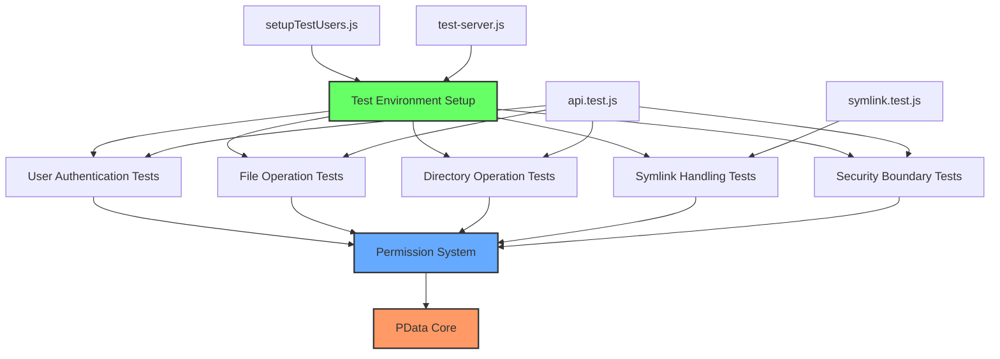
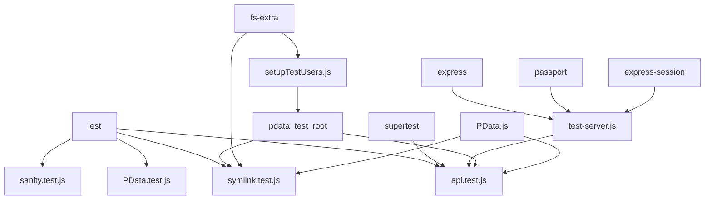
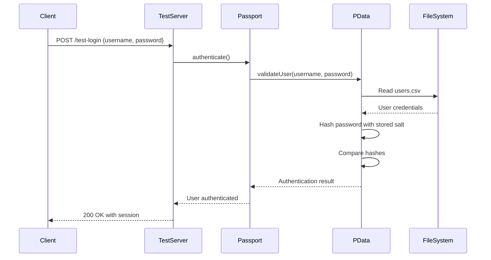
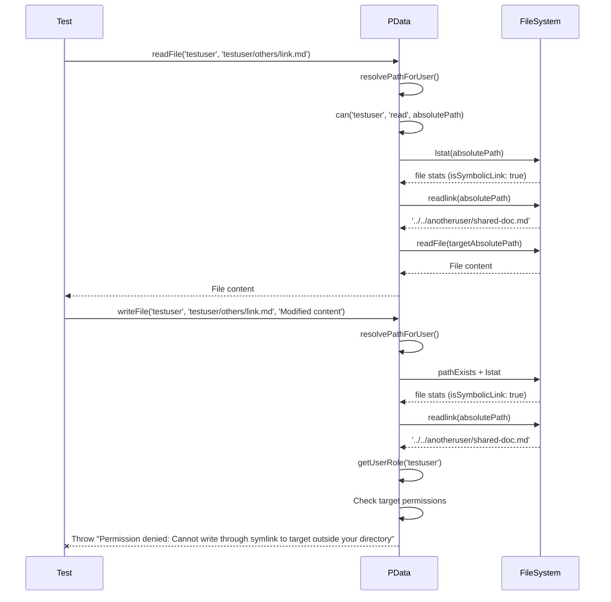

# PData System: Testing Approach and Architecture

This document outlines our approach to verifying the functionality and security of the PData file management system through comprehensive testing. We'll explore the testing architecture, key test scenarios, and how we ensure robust data handling even in edge cases.

## System Overview

PData provides a secure file management layer for our application, handling user authentication, permission management, and file operations with a focus on security and proper data isolation.

## Test Architecture

## Test Dependencies

## Key Test Scenarios

### User Authentication Flow

### Secure File Operations with Symlinks

## Narrative: Journey Through PData Testing

Our testing journey begins with the establishment of a controlled test environment. The `setupTestUsers.js` script crafts a miniature world within the `pdata_test_root` directory, populating it with test users—each with proper password hashing, directory structures, and sample files.

What makes our test environment particularly interesting is how it simulates real-world scenarios. We've created a standard user (`testuser`), an administrative user (`testadmin`), and another user (`anotheruser`) to test cross-user interactions. A special symlink has been established from `testuser/others/link.md` to `anotheruser/shared-doc.md`, which allows us to validate our symlink handling security.

### The Authentication Challenge

Authentication testing is perhaps the most foundational aspect of our system verification. The `api.test.js` file orchestrates a series of challenges to our login system:

1. Attempting to login with invalid credentials
2. Successfully logging in as a test user
3. Verifying session persistence across requests
4. Testing role-based access controls

Our authentication system, powered by Passport.js but using PData's custom `validateUser` method, must properly validate credentials against securely stored password hashes. This critical security layer ensures that users can only access data they're permitted to see.

### File Operations and Boundary Testing

Once authentication is verified, we test file operations across various scenarios:

1. Regular file creation, reading, and deletion within a user's own directory
2. Attempts to access directories outside a user's permitted areas
3. Special case handling for shared resources like the `uploads` directory
4. Administrative access to all directories while maintaining security boundaries

One particularly elegant test involves attempts to traverse directory boundaries with paths containing `../` sequences. PData's path normalization and security checks prevent these attempts, maintaining strict security barriers between user data spaces.

### Symlink Handling: The Advanced Challenge

Symlink handling presents one of the most complex testing scenarios. Our `symlink.test.js` file verifies that PData correctly balances usability with security when dealing with symbolic links:

1. Symlinks should appear in directory listings
2. Reading through symlinks should work, enabling data sharing between users
3. Writing through symlinks requires strict permission validation to prevent unauthorized data modification
4. Administrative users have additional capabilities but remain within security boundaries

When a regular user attempts to write through a symlink to a file owned by another user, our tests verify that PData correctly rejects the operation. However, reading through the same symlink is permitted, allowing for flexible data sharing patterns.

### Test Server: The Environment Simulator

Our `test-server.js` creates a miniature application server that simulates how PData would operate in a production environment. It configures Express, session handling, Passport for authentication, and connects these components to our PData instance.

This approach allows us to test PData not just with direct method calls, but through realistic HTTP requests, validating that the system functions correctly within its intended environment.

## Conclusion

The testing architecture for PData demonstrates how complex security and file handling requirements can be thoroughly validated. By combining unit tests, integration tests, and security boundary tests, we create a robust verification system that ensures PData's security model functions correctly across all scenarios.

Our test suite acts as both verification and documentation, clearly demonstrating the intended behaviors of the system while catching any regressions or edge cases that might otherwise compromise data security.
