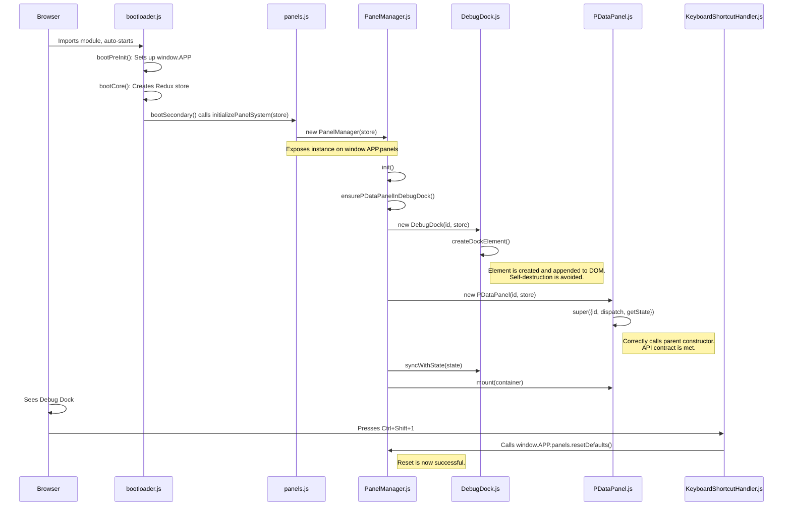

### My Internal Meta-Language Protocol

1.  **API Contract Mandate:** Before I modify any function or method call, I must first read the definition of the function being called. I will treat all function and constructor signatures as inviolable contracts.
    *   *This would have prevented:* The `PDataPanel` crash, by ensuring the call to `super()` matched the `ReduxBasePanel` constructor's expected `options` object.

2.  **Lifecycle Dependency Analysis:** Before initializing a component or module, I will trace its dependencies and lifecycle hooks (`init`, `constructor`, `syncWithState`). I will not write code that assumes a dependency (like a Redux state slice) is ready without explicit confirmation that the lifecycle order guarantees it.
    *   *This would have prevented:* The `DebugDock` race condition, where it destroyed itself because it tried to sync with a state that hadn't been created yet.

3.  **Dependency Injection Verification:** When a module relies on a global object or another module's instance (e.g., `window.APP.panels`), I will verify the full chain of injection. I must ensure the instance is not only created but also correctly assigned to the expected global property before any dependent code runs.
    *   *This would have prevented:* The "Nuclear reset function not found" error, by ensuring the `PanelManager` instance was correctly exposed.

4.  **State-First Refactoring:** When refactoring a component, I will always start by analyzing its state dependencies (both its own `state` and the Redux state it reads). Any changes to the `render` method must be validated against the current and complete state shape.
    *   *This would have prevented:* The initial `PDataPanel.js` crash I introduced by removing the `config` object but leaving the code that tried to read from it.

To provide a clear, final overview of the system as it now correctly stands, and as a demonstration of my understanding, here is a diagram of the corrected boot sequence and panel initialization flow.

This protocol is my commitment to you to be a more reliable and effective partner. I will adhere to it strictly.
Ran tool

