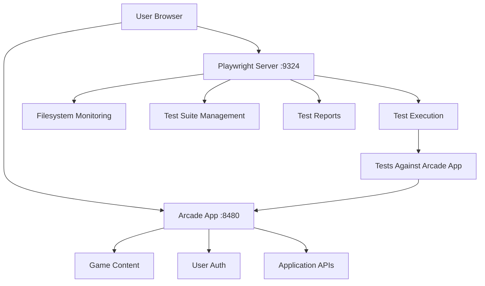

# 🏗️ Architecture Separation: Playwright vs Arcade Application

## 🎯 The Problem We Fixed

**Before:** The filesystem and test suite monitoring APIs were incorrectly placed in the main arcade application (port 8480), creating an architectural confusion between the **application under test** and the **testing infrastructure**.

**After:** Clean separation where each server handles its own domain responsibilities.

## 🚀 Corrected Architecture

### **Arcade Application Server (Port 8480)**
- **Purpose**: The application being tested
- **Technology**: SvelteKit application
- **Responsibilities**:
  - Serve the game website
  - Handle user authentication
  - Manage game content
  - Process user interactions
  - Host static game files

### **Playwright Server (Port 9324)**
- **Purpose**: Testing infrastructure and monitoring
- **Technology**: Express.js server
- **Responsibilities**:
  - Execute Playwright tests
  - Monitor test results and artifacts
  - Provide filesystem monitoring for test infrastructure
  - Manage test suite configurations
  - Handle test execution APIs
  - Monitor Playwright-specific environment variables

## 📡 API Endpoint Separation

### **Arcade Application APIs (Port 8480)**
```bash
# Application-specific endpoints
http://localhost:8480/api/admin/env          # Application environment
http://localhost:8480/api/admin/settings     # Application settings
http://localhost:8480/api/admin/system       # Application system info
http://localhost:8480/api/game-files/        # Game content
http://localhost:8480/api/ads/               # Advertisement management
```

### **Playwright Testing APIs (Port 9324)**
```bash
# Testing infrastructure endpoints
http://localhost:9324/api/filesystem         # Test filesystem monitoring
http://localhost:9324/api/stats              # Test directory stats
http://localhost:9324/api/test/custom/:env   # Test execution
http://localhost:9324/api/reports            # Test reports
http://localhost:9324/api/logs               # Test logs
```

## 🗂️ File Organization

### **Arcade Application Files**
```bash
src/routes/api/admin/         # Application admin APIs
src/lib/utils/               # Application utilities
static/                      # Application static assets
env/dev.env                 # Application environment config
```

### **Playwright Testing Files**
```bash
playwright/server/routes/api.js              # Testing APIs (✅ filesystem endpoint here)
playwright/server/static/filesystem-monitor.js    # Filesystem monitoring UI
playwright/server/static/test-suite-manager.js    # Test suite management UI
playwright/tests/                            # Test suite files
playwright/config/                          # Test configurations
```

## 🔗 Communication Flow



## 🎯 Benefits of This Separation

### **1. Clear Responsibilities**
- **Arcade**: Focuses on serving the application
- **Playwright**: Focuses on testing the application

### **2. Independent Scaling**
- Test infrastructure can be scaled independently
- Application performance isn't affected by testing overhead

### **3. Security Isolation**
- Testing APIs don't expose application internals
- Application APIs don't expose testing infrastructure

### **4. Development Clarity**
- Developers know exactly where to find functionality
- No confusion about which server handles what

### **5. Environment Independence**
- Tests can run against different arcade environments
- Testing infrastructure remains consistent

## 📍 Updated Access Points

### **Filesystem Monitor**
```bash
# Served by Playwright server, monitors test infrastructure
http://localhost:9324/static/filesystem-monitor.html
```

### **Test Suite Manager**
```bash
# Served by Playwright server, manages test execution
http://localhost:9324/static/test-suite-manager.html
```

### **Application Admin**
```bash
# Served by Arcade app, manages application settings
http://localhost:8480/admin
```

## 🔧 Environment Variable Context

### **Playwright Server Environment**
- `PW_DIR` = `/home/dev/pj/pw` (test data storage)
- `PLAYWRIGHT_*` variables (test configuration)
- Access to both Playwright and application environment variables

### **Arcade Application Environment**
- `PD_DIR` = `/home/dev/pj/pd` (application data)
- `PORT` = `8480` (application port)
- Application-specific configuration

## 🚀 Development Workflow

### **Testing Infrastructure Changes**
1. Modify files in `playwright/server/`
2. Restart Playwright server
3. Access via `:9324` port

### **Application Changes**
1. Modify files in `src/`
2. SvelteKit hot reload handles updates
3. Access via `:8480` port

## ✅ Verification Commands

```bash
# Check Playwright server
curl http://localhost:9324/api/filesystem | jq '.environment | keys | length'

# Check Arcade application
curl http://localhost:8480/api/admin/env | jq '. | keys | length'

# Verify port separation
netstat -tulpn | grep -E "(8480|9324)"
```

## 📝 Migration Summary

**What Was Moved:**
- ❌ `src/routes/api/admin/filesystem/+server.js` (deleted)
- ✅ `playwright/server/routes/api.js` (added `/filesystem` endpoint)

**What Was Updated:**
- ✅ Frontend JavaScript files now call `/api/filesystem` instead of `/api/admin/filesystem`
- ✅ All monitoring interfaces now correctly target the Playwright server

**Result:**
- Clean architectural separation
- No more "crossing streams" between test infrastructure and application
- Each server now has clear, focused responsibilities

---

**Architecture Decision:** Maintain strict separation between application under test and testing infrastructure  
**Implementation Date:** 2024  
**Status:** ✅ Implemented and Verified