# Data Generation and Ellipse Calculation Flow

```mermaid
flowchart TD
    Start([User Interaction]) --> Config[gmmConfig Object]

    Config --> |centers, spreads, nPerClass| GenData[generateData]

    GenData --> Loop1{For each class c=0,1,2}
    Loop1 --> GenSamples[Generate N standard normal samples z ~ N0,1]

    GenSamples --> Scale[Scale by spreads: sample = z * spreads c d]
    Scale --> Translate[Translate by centers: features d = centers c d + sample d]

    Translate --> AddToData[Add to data array with .features and .class]
    AddToData --> Loop1
    Loop1 --> |Done| DataReady[Data Array Ready]

    DataReady --> UserAction{User Action?}

    UserAction --> |Toggle Ellipses| DrawScatter[drawScatter canvas, data, dimX, dimY, showEllipses]
    UserAction --> |Regenerate| GenData
    UserAction --> |Change Sliders| UpdateConfig[Update gmmConfig] --> GenData

    DrawScatter --> CalcRanges[Calculate minX, maxX, minY, maxY from data]
    CalcRanges --> DrawGrid[Draw grid and axes]

    DrawGrid --> ShowEllipsesCheck{showEllipses == true?}

    ShowEllipsesCheck --> |Yes| LoopClasses{For each class c=0,1,2}
    ShowEllipsesCheck --> |No| DrawPoints

    LoopClasses --> ComputeCov[compute2DCovMatrix data, c, dimX, dimY]

    ComputeCov --> FilterClass[Filter data to class c]
    FilterClass --> CalcMeans[Calculate meanX, meanY from filtered data]
    CalcMeans --> CalcCov[Calculate covXX, covYY, covXY from deviations]
    CalcCov --> ReturnCov[Return: covXX, covYY, covXY, meanX, meanY]

    ReturnCov --> DrawEllipse[drawEllipse ctx, centerX, centerY, covXX, covYY, covXY, ...]

    DrawEllipse --> TransformCenter[Transform center to canvas coords]
    TransformCenter --> CalcScales[scaleX = w-2*pad / maxX-minX<br/>scaleY = h-2*pad / maxY-minY]

    CalcScales --> TransformCov[Transform covariance to canvas space:<br/>covXX_canvas = covXX * scaleX²<br/>covYY_canvas = covYY * scaleY²<br/>covXY_canvas = covXY * scaleX * scaleY * -1]

    TransformCov --> EigenDecomp[Eigenvalue Decomposition:<br/>trace = a + d<br/>det = ad - bc<br/>discriminant = sqrt trace²/4 - det]

    EigenDecomp --> CalcEigenvalues[λ₁ = trace/2 + discriminant<br/>λ₂ = trace/2 - discriminant]

    CalcEigenvalues --> CalcAngle{b < 1e-10?}
    CalcAngle --> |Yes| AlignedAngle[angle = a >= d ? 0 : π/2]
    CalcAngle --> |No| GeneralAngle[angle = atan2 b, λ₁-a]

    AlignedAngle --> CalcRadii
    GeneralAngle --> CalcRadii[rx = nstd * sqrt λ₁<br/>ry = nstd * sqrt λ₂]

    CalcRadii --> NstdParam{{nstd parameter<br/>Currently: 2<br/>Could be: SLIDER}}

    NstdParam --> RenderEllipse[Canvas render:<br/>translate cx,cy<br/>rotate angle<br/>ellipse 0,0,rx,ry]

    RenderEllipse --> LoopClasses
    LoopClasses --> |Done| DrawPoints[Draw data points on canvas]

    DrawPoints --> Done([Visualization Complete])

    style Config fill:#e1f5ff
    style GenData fill:#fff4e1
    style ComputeCov fill:#ffe1f5
    style DrawEllipse fill:#ffe1e1
    style NstdParam fill:#90EE90,stroke:#006400,stroke-width:3px
    style TransformCov fill:#ffcccc
    style CalcAngle fill:#ffcccc
```



## Key Points for Modifications

### 1. Where Ellipse Calculations Are Made:
- **compute2DCovMatrix**: Lines 15-43 in `statistics.js` - Computes empirical covariance from data
- **drawEllipse**: Lines 13-56 in `scatter-plot.js` - Transforms covariance and renders ellipse

### 2. Where nstd (Confidence Level) Could Be Added as Slider:

**Current hardcoded value**: `nstd = 2` (95% confidence for 2D Gaussian)

**Places to modify**:

1. **Add to gmmConfig** (`data-generator.js`):
```javascript
export const gmmConfig = {
  // ... existing config
  ellipseConfidence: 2.0  // NEW: confidence level multiplier
};
```

2. **Update drawEllipse call** (`scatter-plot.js` line 129):
```javascript
drawEllipse(ctx, cov.meanX, cov.meanY, cov.covXX, cov.covYY, cov.covXY,
            w, h, pad, minX, maxX, minY, maxY, colors[c], 0.15,
            gmmConfig.ellipseConfidence);  // Use config instead of hardcoded 2
```

3. **Add HTML slider** (in synthetic-iris.html):
```html
<label>
  Ellipse Confidence: <span id="confidenceValue">2.0σ (95%)</span>
  <input type="range" id="confidenceSlider" min="1" max="3" step="0.1" value="2.0">
</label>
```

4. **Add event listener**:
```javascript
confidenceSlider.addEventListener('input', (e) => {
  const val = parseFloat(e.target.value);
  gmmConfig.ellipseConfidence = val;
  const pct = val === 1 ? '68%' : val === 2 ? '95%' : val === 3 ? '99.7%' :
              Math.round((1 - Math.exp(-val*val/2)) * 100) + '%';
  confidenceValue.textContent = val.toFixed(1) + 'σ (' + pct + ')';
  drawAllVisualizations();  // Redraw without regenerating data
});
```

### 3. Confidence Level Reference:
- **1σ**: ~68% of data (1 standard deviation)
- **2σ**: ~95% of data (2 standard deviations) - CURRENT DEFAULT
- **3σ**: ~99.7% of data (3 standard deviations)

The slider would allow users to interactively see how the ellipse size changes with confidence level while keeping the same underlying data distribution.
