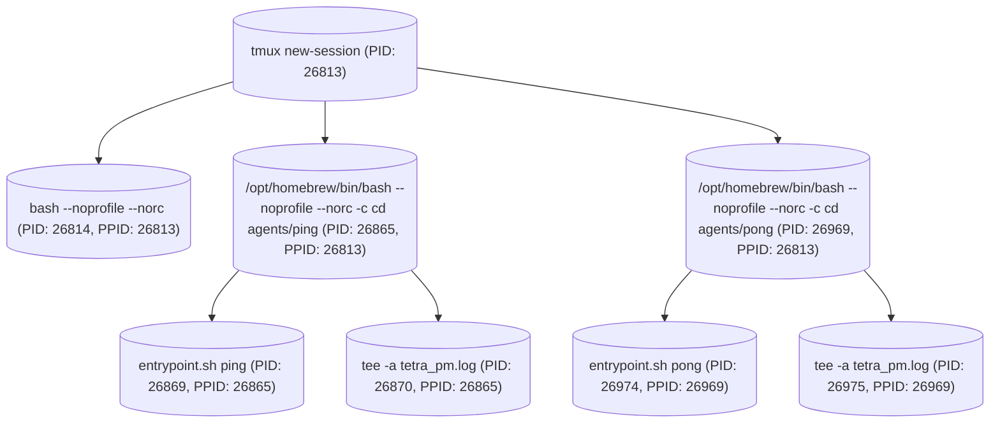
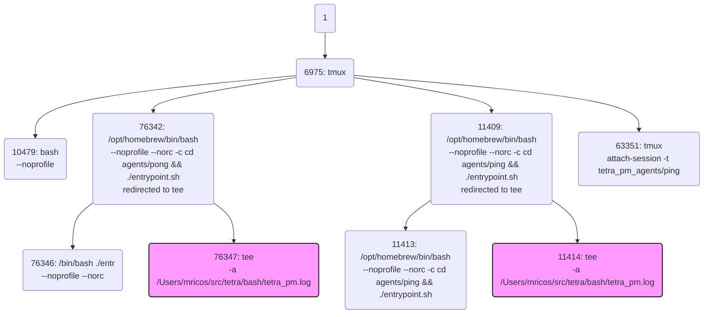

```mermaid
graph TD
    tmux_main[("tmux new-session (PID: 26813)")]
    bash_main[("bash --noprofile --norc (PID: 26814, PPID: 26813)")]
    bash_ping[("/opt/homebrew/bin/bash --noprofile --norc -c cd agents/ping (PID: 26865, PPID: 26813)")]
    bash_pong[("/opt/homebrew/bin/bash --noprofile --norc -c cd agents/pong (PID: 26969, PPID: 26813)")]
    entry_ping[("entrypoint.sh ping (PID: 26869, PPID: 26865)")]
    tee_ping[("tee -a tetra_pm.log (PID: 26870, PPID: 26865)")]
    entry_pong[("entrypoint.sh pong (PID: 26974, PPID: 26969)")]
    tee_pong[("tee -a tetra_pm.log (PID: 26975, PPID: 26969)")]

    tmux_main --> bash_main
    tmux_main --> bash_ping
    tmux_main --> bash_pong
    bash_ping --> entry_ping
    bash_ping --> tee_ping
    bash_pong --> entry_pong
    bash_pong --> tee_pong
```

```mermaid
graph TD
    init1(1) --> tmux6975(6975: tmux)
    tmux6975 --> bash10479(10479: bash\n--noprofile)
    tmux6975 --> tmux76342(76342: /opt/homebrew/bin/bash\n--noprofile --norc -c cd agents/pong && ./entrypoint.sh\nredirected to tee)
    tmux6975 --> tmux11409(11409: /opt/homebrew/bin/bash\n--noprofile --norc -c cd agents/ping && ./entrypoint.sh\nredirected to tee)
    tmux6975 --> tmux63351(63351: tmux\nattach-session -t tetra_pm_agents/ping)
    tmux76342 --> bash76346(76346: /bin/bash ./entr\n--noprofile --norc)
    tmux76342 --> tee76347(76347: tee\n-a /Users/mricos/src/tetra/bash/tetra_pm.log)
    tmux11409 --> opt11413(11413: /opt/homebrew/bin/bash\n--noprofile --norc -c cd agents/ping && ./entrypoint.sh)
    tmux11409 --> tee11414(11414: tee\n-a /Users/mricos/src/tetra/bash/tetra_pm.log)

    classDef teed fill:#f9f,stroke:#333,stroke-width:2px;
    class tee76347,tee11414 teed;
```