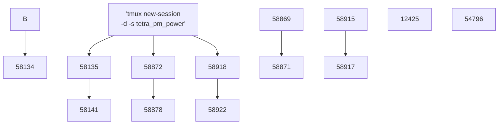

```mermaid
graph TD
    A['tmux new-session \n-d -s tetra_pm_power']
    B --> C[58134]
    A --> D[58135]
    D --> E[58141]
    A --> F[58872]
    F --> G[58878]
    A --> H[58918]
    H --> I[58922]
    J[58869] --> K[58871]
    L[58915] --> M[58917]
    N[12425]
    O[54796]
```